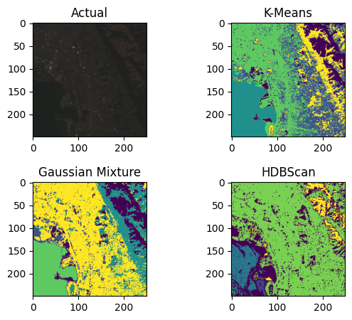

### Remote Sensing Modeling

**David House**

#### Executive summary
Remote sensing is a crucial tool in environmental monitoring, providing valuable insights into land cover changes, deforestation, and oceanic phenomena such as oil spills. The application of unsupervised machine learning models in remote sensing offers a powerful approach to identifying regions of interest and tracking changes in an automated manner. By leveraging satellite imagery data, these models can categorize ground cover types without requiring labeled data, thus enabling scalable and efficient environmental analysis. This study explores the effectiveness of clustering techniques, including K-Means, Gaussian Mixture Models (GMM), and HDBSCAN, in mapping land cover types using LandSat 8 satellite imagery.

#### Rationale
Accurate and automated environmental monitoring is critical for addressing global challenges such as climate change, deforestation, and pollution. Traditional methods of analyzing satellite images often require extensive manual labeling and domain expertise, limiting scalability. Unsupervised machine learning offers a potential solution by autonomously detecting patterns in multispectral data, allowing for:

Deforestation Tracking: Identifying tree cover loss over time.

Oil Spill Monitoring: Detecting anomalies in ocean surface reflectance.

Urban Expansion Studies: Differentiating between natural and built environments.

Agricultural Analysis: Classifying vegetation health and land use patterns.

This study investigates whether unsupervised learning techniques can effectively map different ground cover types and track changes over time using satellite imagery.

#### Research Question
Can unsupervised machine learning methods effectively map ground cover types and identify areas of interest in remote sensing applications?

#### Data Sources
This study utilizes LandSat 8 imagery from the [USGS Earth Explorer](https://earthexplorer.usgs.gov/), which provides high-resolution multispectral satellite images. LandSat 8 captures spectral data across various bands, including:

Visible Bands (Red, Green, Blue): Useful for natural color visualization.

Near-Infrared (NIR): Highlights vegetation health.

Shortwave Infrared (SWIR): Differentiates water bodies and soil moisture.

Thermal Infrared (TIR): Helps detect temperature variations.

#### Methodology
To analyze land cover classification, this study applies three unsupervised learning techniques:

## 1. Feature Selection and Transformation

* Standardized reflectance values from multiple LandSat 8 bands.

* Applied band transformations such as Normalized Difference Vegetation Index (NDVI).

## 2. Clustering Techniques

# K-Means Clustering

Partitioned pixels into clusters based on spectral similarities.

Required predefining the number of clusters (k), with optimal k determined using the Elbow Method.

# Gaussian Mixture Model (GMM)

Probabilistic clustering approach allowing soft assignments of pixels to multiple clusters.

Useful for handling transitionary land cover areas.

# HDBSCAN (Hierarchical Density-Based Clustering)

Density-based method capable of identifying noise and separating complex land cover types.

Automatically determines the optimal number of clusters, reducing parameter tuning requirements.

#### Results
After applying standard band transformations, the clustering results provided clear distinctions between different land cover types:

* K-Means Clustering: Effectively separated water bodies, dry regions, forests, and highly reflective surfaces (e.g., snow and urban areas).

* GMM Clustering: Produced results similar to K-Means but with more gradual transitions between regions.

* HDBSCAN: Outperformed in handling noisy regions, especially in mountainous terrains, and provided better-defined class boundaries.

These results demonstrate that unsupervised clustering can effectively categorize land cover types, providing an automated approach to environmental monitoring.

#### Next steps
Future work could explore:

* Applying the trained models to different geographic regions to assess generalization capabilities.

* Integrating temporal analysis to detect environmental changes over time.

* Combining supervised learning approaches to refine classification accuracy.

* Evaluating alternative clustering algorithms for improved segmentation.

#### Outline of project

- [Notebook](main.ipynb)
- [Findings](Findings.docx)

